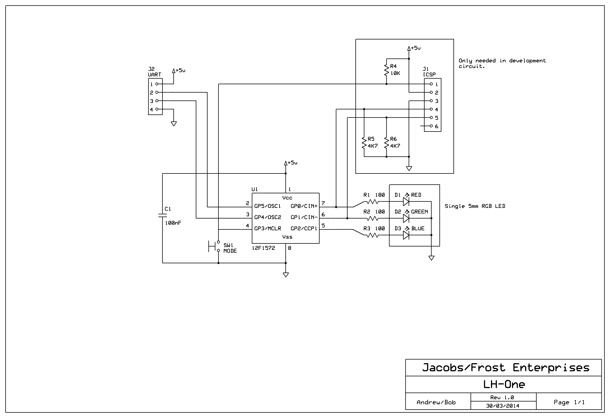
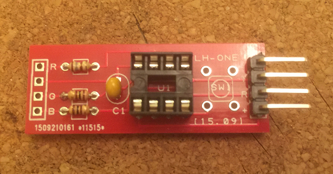

# lh-one - A Model Lighthouse Controller

This is a silly project my friend Robert Frost and I dreamed up one night in [Reading Makerspace](http://www.rlab.org.uk). Our cunning plan was to sell it as a simple electronics kit (a PCB, a bag of bits and some instructions) on eBay.

The circuit is very simple. A small PIC micro-controller generates three PWM signals to the pins of an RGB LED via some load resistors. A tact switch lets you select the pattern (or ['Light Charactertic'](https://en.wikipedia.org/wiki/Light_characteristic)) to be displayed.

I put together a small two-sided PCB to keep things neat and tidy.

The four pin header provides power (5V) and the option of an RS-232 connection which I was going to use to let users program their own characteristic using a built in 'monitor'. You can connect to the board using a PL2303 or FTDT232RL USB serial module and a terminal emulator like TeraTerm. 

Someone in the hackspace thought it needed a model to show it off and 3D-printed a lighthouse which I painted with a fetching set of stripes.

<video width="272" height="480" controls>
  <source src="video/video.mp4" type="video/mp4">
</video>

Sadly Bob passed away in May 2017 following a stroke and the project was not finished.

In memory of my friend I've decided to clean up the code, schematics and PCB design then release it all on Github.

## To Do:

These tasks remain to be completed:

1. I need to complete and rationalise the UK lighthouse characteristics.
2. I intended to use the UART to communicate with a PC hosted application that allows custom patterns to be created and downloaded.